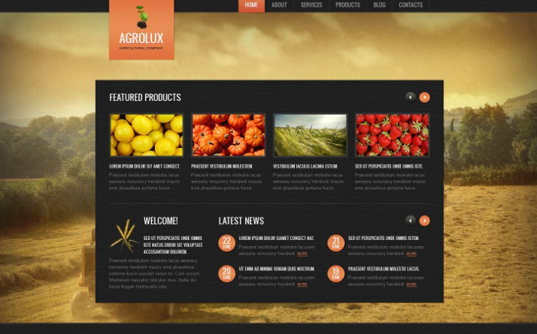
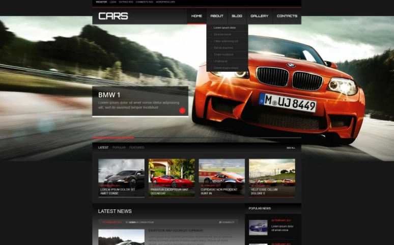
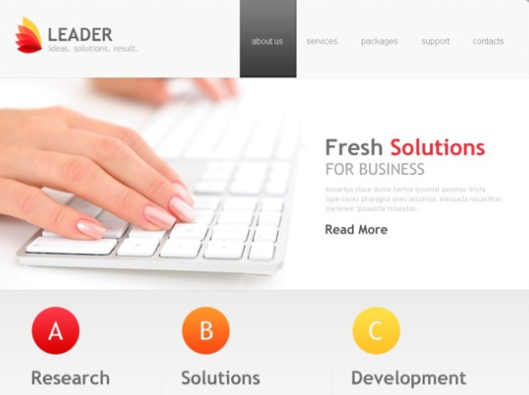

# WordPress Projects Portfolio

This repository showcases three visually distinct WordPress websites created for different types of businesses and audiences. Each site highlights a unique design approach, tailored content layout, and WordPress-based development strategy.

## 🌾 1. Agrolux – Agricultural Company Website

**Theme:** Rustic, Earth-toned, Product-Oriented  
**Description:**  
A website designed for an agricultural company that highlights featured products such as fruits and vegetables. The layout is user-friendly, with strong visual focus on product images and recent news updates. The site evokes a natural, rural atmosphere suitable for agribusinesses.

**Main Features:**
- Featured products slider
- Welcome section and latest news area
- Earthy color palette and rural imagery

## 🏎️ 2. Cars – Automotive Website

**Theme:** Dynamic, High-Performance, Modern  
**Description:**  
A visually engaging website focused on high-end automobiles. Developed with a sleek, dark UI and high-contrast images, this WordPress site is suitable for automotive blogs, car dealerships, or racing events.

**Main Features:**
- Full-width banner with featured vehicle
- Dropdown navigation menu
- Latest car news and blog entries
- Sports-inspired, fast-paced aesthetic

## 💼 3. Leader – Business Solutions Website

**Theme:** Clean, Professional, Minimalistic  
**Description:**  
A modern corporate WordPress site tailored for consulting firms or SaaS businesses. It uses a light color palette with emphasis on clean UI/UX and structured information flow.

**Main Features:**
- Services and packages overview
- Sectioned layout for Research, Solutions, and Development
- Professional tone with call-to-action buttons

## 🔧 Tech Stack

- **CMS:** WordPress
- **Languages:** HTML, CSS, PHP (via WordPress theme development)
- **Tools:** Theme customization, WordPress plugins, responsive design

## 📬 Contact

If you're interested in collaboration or custom WordPress development, feel free to reach out:

**Ingrid Vasconcelos**  

